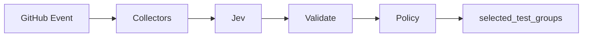

# JEV Test Intelligence

[](https://github.com/JevForge/jev-test-intelligence/releases)
[](LICENSE)
[](https://github.com/JevForge/jev-test-intelligence/actions/workflows/ci.yml)
[](https://nodejs.org/)

**Select which allowlisted test groups should run after a change** — and which ones can safely be skipped — using [TypeSafe Jev](https://vercel.com/ai-gateway/models/jev) as a typed decision layer inside GitHub Actions.

Running every suite on every PR burns minutes and money. Letting an unconstrained model invent skip lists is unsafe. Test Intelligence keeps the group list in your config, asks Jev which allowlisted groups the change needs, then applies deterministic rules a model cannot bypass. Downstream jobs read `selected_test_groups` with `if:`. **This Action never executes tests** and never rewrites workflows.

```yaml
- id: ti
  uses: JevForge/jev-test-intelligence@v0
  env:
    AI_GATEWAY_API_KEY: ${{ secrets.AI_GATEWAY_API_KEY }}
```

Prefer less boilerplate? Use the composite wrapper (checkout + Test Intelligence + re-exported outputs):

```yaml
- id: ti
  uses: JevForge/jev-test-intelligence/composite@v0
  env:
    AI_GATEWAY_API_KEY: ${{ secrets.AI_GATEWAY_API_KEY }}
```

## Features

* Typed test-group selection powered by Jev (`experimental_evaluate`, not free-form generation)
* Secret-based authentication (`AI_GATEWAY_API_KEY`, `TYPESAFE_API_KEY`, or `JEV_CUSTOM_API_KEY`)
* Structured outputs for later jobs (`selected_test_groups`, `decision`, `confidence`, …)
* Deterministic allowlist, path hits, component maps, always-on groups, and dependency closure
* Optional coverage gaps, failure history, and framework discovery (Jest, Vitest, Pytest, JUnit, Playwright, Cypress)
* Safe failure policies: `fail` | `warn` | `request-review` | `no-op`
* `force_full_suite` and low-confidence paths default toward a safe full allowlist
* `dry_run` (default `true`) suppresses step failure on policy `fail` — set `false` to fail the step

## How it works

```text
GitHub event / changed paths
        ↓
Collect config, diff, optional coverage / history / frameworks
        ↓
Normalize + redact
        ↓
Jev evaluates each allowlisted group (typed booleans)
        ↓
Schema validation + confidence policy
        ↓
selected_test_groups / skipped_test_groups
        ↓
Downstream jobs use if: contains(fromJSON(...), 'unit')
```



1. Load the group allowlist from `.jev/test-intelligence.yml` (or `group_map`).
2. Collect changed paths from the event or `changed_paths`.
3. Optionally gather coverage, history, components, and framework inventory as evidence.
4. Call Jev through `jev_provider` (no silent provider fallback) — or use `decision_mode: deterministic`.
5. Validate the response; drop unknown group ids; close `needs` edges.
6. Emit outputs. Free-form `summary` and configured `command` strings are display-only and must never be executed by this Action.

## Demo

```text
Pull Request touches src/auth/login.ts
        ↓
Allowlist: unit, integration, e2e, docs
        ↓
Jev → select unit + e2e (path / component evidence)
Policy → close needs, keep path hits
        ↓
selected_test_groups = ["unit","e2e"]
skipped_test_groups  = ["integration","docs"]
        ↓
Only unit and e2e jobs execute
```

## Why JEV?

Jev is the decision engine, not a chat model in this Action. Test Intelligence asks one boolean question per allowlisted group (plus abstain / request-review / run-all). That returns a typed selection instead of prose you would have to parse or trust as shell.

The deterministic executor still owns the effect: allowlist, path hits, component hits, always-on groups, dependency closure, coverage/history bias, and the low-confidence policy. If Jev is down or the schema rejects the answer, the Action does not invent a “smart” skip list — it follows `low_confidence_policy` (default `warn` → run all groups) and marks `provisional=true`.

## Quick Start

1. Copy [`examples/.jev/test-intelligence.yml`](examples/.jev/test-intelligence.yml) to `.jev/test-intelligence.yml` in your consumer repo. Protect it with CODEOWNERS (see [`examples/CODEOWNERS`](examples/CODEOWNERS) and [`examples/branch-protection.md`](examples/branch-protection.md)).
2. Add repository secret `AI_GATEWAY_API_KEY` (default provider). Skip this step only if you use `decision_mode: deterministic`.
3. Add a workflow (see [`examples/basic.yml`](examples/basic.yml)):

```yaml
name: Selective tests
on:
  pull_request:

permissions:
  contents: read
  pull-requests: read

jobs:
  select:
    runs-on: ubuntu-latest
    outputs:
      groups: ${{ steps.ti.outputs.selected_test_groups }}
    steps:
      - uses: actions/checkout@v4
      - id: ti
        uses: JevForge/jev-test-intelligence@v0
        env:
          AI_GATEWAY_API_KEY: ${{ secrets.AI_GATEWAY_API_KEY }}

  unit:
    needs: select
    if: contains(fromJSON(needs.select.outputs.groups), 'unit')
    runs-on: ubuntu-latest
    steps:
      - uses: actions/checkout@v4
      - run: npm test
```

Pin `@v0` for the floating major, `@v0.1.0` for a fixed release, or a commit SHA for the strongest supply-chain guarantee.

## Complete Example

```yaml
name: Selective tests
on:
  pull_request:
  push:
    branches: [main]

permissions:
  contents: read
  pull-requests: read
  # pull-requests: write  # only if comment_on_github: true
  # checks: write         # only if create_check_run: true

jobs:
  select:
    runs-on: ubuntu-latest
    outputs:
      groups: ${{ steps.ti.outputs.selected_test_groups }}
      decision: ${{ steps.ti.outputs.decision }}
      provisional: ${{ steps.ti.outputs.provisional }}
      full_suite: ${{ steps.ti.outputs.full_suite }}
    steps:
      - uses: actions/checkout@v4

      - id: ti
        uses: JevForge/jev-test-intelligence@v0
        env:
          AI_GATEWAY_API_KEY: ${{ secrets.AI_GATEWAY_API_KEY }}
        with:
          config_path: .jev/test-intelligence.yml
          min_confidence: '0.7'
          low_confidence_policy: warn
          require_path_hits: 'true'
          discover_frameworks: 'true'

      - name: Show selection
        run: |
          echo "decision=${{ steps.ti.outputs.decision }}"
          echo "selected=${{ steps.ti.outputs.selected_test_groups }}"
          echo "skipped=${{ steps.ti.outputs.skipped_test_groups }}"
          echo "provisional=${{ steps.ti.outputs.provisional }}"

  unit:
    needs: select
    if: contains(fromJSON(needs.select.outputs.groups), 'unit')
    runs-on: ubuntu-latest
    steps:
      - uses: actions/checkout@v4
      - run: npm test

  e2e:
    needs: select
    if: contains(fromJSON(needs.select.outputs.groups), 'e2e')
    runs-on: ubuntu-latest
    steps:
      - uses: actions/checkout@v4
      - run: npx playwright test
```

## Using outputs in conditions

```yaml
- name: Run unit suite
  if: contains(fromJSON(steps.ti.outputs.selected_test_groups), 'unit')
  run: npm test

- name: Require review when provisional
  if: steps.ti.outputs.needs_review == 'true'
  run: echo "Human review requested before trusting skips"

- name: Fail closed on policy fail (consumer side)
  if: steps.ti.outputs.provisional == 'true' && steps.ti.outputs.full_suite == 'true'
  run: echo "Selection was provisional; full suite selected"
```

Prefer `fromJSON(selected_test_groups)` over the CSV outputs when writing `if:` expressions.

## Authentication

Secrets are read from the job environment (never from hardcoded workflow values):

| Provider | Secret | Notes |
| --- | --- | --- |
| `vercel-ai-gateway` (default) | `AI_GATEWAY_API_KEY` | Model defaults to `typesafe-ai/jev` |
| `typesafe-native` | `TYPESAFE_API_KEY` | Requires `jev_endpoint` + `jev_model` |
| `custom-compatible` | `JEV_CUSTOM_API_KEY` | Requires HTTPS `jev_endpoint` + `jev_model` |

```text
Repository → Settings → Secrets and variables → Actions → New repository secret
Name: AI_GATEWAY_API_KEY
```

There is **no silent fallback** between providers. Set `jev_provider` (or `.jev/config.yml`) explicitly when not using the default.

## Permissions

Minimum for path collection on pull requests:

```yaml
permissions:
  contents: read
  pull-requests: read
```

Optional:

| Feature | Extra permission |
| --- | --- |
| `comment_on_github: true` | `pull-requests: write` |
| `create_check_run: true` | `checks: write` |
| `include_history: true` (Actions API) | `actions: read` |

## Inputs

| Input | Required | Default | Description |
| --- | --- | --- | --- |
| `config_path` | no | `.jev/test-intelligence.yml` | Path/component → group allowlist config |
| `changed_paths` | no | _(empty)_ | Newline list or JSON array; empty uses the GitHub event |
| `group_map` | no | _(empty)_ | JSON array that replaces groups from the config file |
| `component_map` | no | _(empty)_ | JSON array that replaces components from the config file |
| `jev_provider` | no | `vercel-ai-gateway` | `vercel-ai-gateway` \| `typesafe-native` \| `custom-compatible` |
| `jev_model` | no | _(provider default)_ | Model id |
| `jev_endpoint` | no | _(empty)_ | HTTPS endpoint for native/custom providers |
| `jev_timeout_ms` | no | `45000` | Provider timeout (1000–120000) |
| `jev_config_path` | no | `.jev/config.yml` | Shared Jev settings file |
| `min_confidence` | no | `0.7` (or config) | Minimum confidence before skips are trusted |
| `low_confidence_policy` | no | `warn` (or config) | `fail` \| `warn` \| `request-review` \| `no-op` |
| `force_full_suite` | no | `false` | Select every allowlisted group |
| `include_history` | no | `false` | Read history file + recent GitHub Actions failures |
| `history_path` | no | `.jev/test-history.json` | History file path |
| `history_lookback` | no | config / `10` | 1–20 recent runs |
| `history_branch` | no | _(empty)_ | Limit history to one branch |
| `history_group_id_map` | no | _(empty)_ | JSON map of Actions job display name → group id |
| `coverage_path` | no | _(empty)_ | Coverage JSON for gap detection |
| `coverage_threshold` | no | `0.8` | Line coverage ratio 0–1 |
| `discover_frameworks` | no | `true` | Discover test frameworks as evidence |
| `frameworks` | no | _(all)_ | Comma-separated adapter allowlist |
| `require_path_hits` | no | `true` | Always keep path-matching groups |
| `decision_mode` | no | `jev` | `jev` \| `deterministic` |
| `cache_decisions` | no | `false` | Restore/save typed decisions via GitHub Actions cache |
| `comment_on_github` | no | `false` | Upsert PR comment |
| `create_check_run` | no | `false` | Create Check Run |
| `telemetry` | no | `false` | Structured duration log (no secrets/paths) |
| `trust_repo_jev_endpoint` | no | `false` | Allow repo config endpoint to receive credentials |
| `token` | no | `${{ github.token }}` | Token for PR file listing |
| `dry_run` | no | `true` | Do not fail the step on policy `fail` |

Full metadata: [`action.yml`](action.yml).

## Outputs

| Output | Description |
| --- | --- |
| `decision` | `SELECT_GROUPS` \| `RUN_ALL` \| `ABSTAIN` \| `REQUEST_REVIEW` |
| `selected_test_groups` | JSON array of group ids to run (config order) |
| `skipped_test_groups` | JSON array of group ids to skip |
| `selected_test_groups_csv` | CSV form (prefer JSON + `fromJSON`) |
| `skipped_test_groups_csv` | CSV form (prefer JSON + `fromJSON`) |
| `confidence` | Jev confidence `0..1` (policy does not inflate it) |
| `reason_codes` | JSON array of stable reason codes |
| `summary` | Plain-text explanation — never execute |
| `provisional` | `true` when selection came from policy, not trusted Jev |
| `needs_review` | `true` when request-review policy applied |
| `affected_paths` | JSON array of normalized changed paths |
| `history_applied` | Groups forced in by recent failures |
| `frameworks_detected` | Discovered framework ids |
| `coverage_gaps` | Changed paths below coverage threshold |
| `commands` | JSON map group → configured command (not executed) |
| `matrix` | `strategy.matrix` helper `{"include":[{"group":"..."}]}` |
| `if_snippets` | Suggested `if:` expressions per group |
| `jev_provider` | Provider that was asked |
| `cache_hit` | `true` when decision restored from cache |
| `full_suite` | `true` when every allowlisted group was selected |

## Configuration

Minimal `.jev/test-intelligence.yml`:

```yaml
version: 1
groups:
  - id: unit
    paths: [src/**]
    command: npm test
  - id: e2e
    paths: [e2e/**, src/ui/**]
    needs: [unit]
    frameworks: [playwright]
components:
  - name: auth
    paths: [src/auth/**]
    groups: [unit, e2e]
```

See [`examples/.jev/`](examples/.jev/) for a fuller sample, history file, and shared Jev config.

## Data Sent to JEV

Only sanitized evidence is sent:

* Changed paths (capped)
* Group ids, path globs, needs, always flags, path/component hits
* Coverage gap counts (not full reports)
* Framework inventory names/globs (not raw config scripts)
* An untrusted-content note

Never: tokens, secrets, raw workflow scripts, or arbitrary file contents.

## Security

* Secrets stay in GitHub Actions secrets / environment variables
* Common token patterns are redacted from logs and summaries
* Custom/native endpoints must be public HTTPS (private/metadata hosts blocked)
* Model text, summaries, and `group.command` are never executed
* Path/component/history content is labeled untrusted for Jev
* Repository `jev_endpoint` cannot receive credentials unless `trust_repo_jev_endpoint: true`

Report vulnerabilities via [GitHub Security Advisories](https://github.com/JevForge/jev-test-intelligence/security/advisories/new). See [SECURITY.md](SECURITY.md).

## Troubleshooting

| Symptom | What to check |
| --- | --- |
| Always runs the full suite | Low confidence, Jev unavailable, `force_full_suite`, or `warn`/`fail` policy |
| No groups selected | Empty allowlist / config path, or `no-op` with no always/history hits |
| Auth errors | Secret name matches provider (`AI_GATEWAY_API_KEY` vs `TYPESAFE_API_KEY`) |
| PR paths empty | `pull-requests: read` and a valid `token` |
| Unexpected skips | Confirm path globs, `require_path_hits`, and component maps |

Logs are prefixed with `[JEV Test Intelligence]`.

## Versioning

| Pin | Meaning |
| --- | --- |
| `@v0` | Floating major (moves with new `0.x` releases) |
| `@v0.1.0` | Exact SemVer release |
| `@<sha>` | Strongest supply-chain pin |

Consumers use committed `dist/index.js` — they do not run `npm install` for this Action.

## Development

```bash
git clone https://github.com/JevForge/jev-test-intelligence.git
cd jev-test-intelligence
npm ci
npm run all   # typecheck + coverage + build
```

Requires Node 24+. See [CONTRIBUTING.md](CONTRIBUTING.md).

## Marketplace

Listing notes: [docs/marketplace.md](docs/marketplace.md).

## License

[MIT](LICENSE) © JevForge
