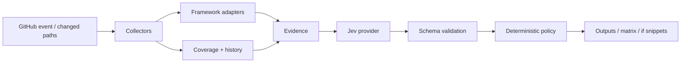

# JEV Test Intelligence

Select which allowlisted test groups to run after a change. **Jev** decides; your workflow stays in control.

This GitHub Action maps changed paths and components to configured test groups, optionally asks TypeSafe **Jev** for a typed selection, then applies a deterministic policy that never executes shell commands from model text.

## How it works



1. Load `.jev/test-intelligence.yml` (groups, components, optional commands).
2. Collect changed paths, optional coverage gaps, test history, and framework inventory (Jest, Vitest, Pytest, JUnit, Playwright, Cypress).
3. Ask Jev (`vercel-ai-gateway` by default) for boolean answers per allowlisted group — or use `decision_mode: deterministic`.
4. Validate the typed decision. Unknown group ids are rejected.
5. Apply policy: low confidence / unavailable Jev → safe full suite (unless `no-op`), never silent provider fallback.
6. Emit `selected_test_groups`, matrix helpers, and optional PR comment / check run. **Tests are never executed by this action.**

## Quick start

```yaml
- uses: JevForge/jev-test-intelligence@v0
  with:
    config_path: .jev/test-intelligence.yml
    decision_mode: deterministic # or jev
  env:
    AI_GATEWAY_API_KEY: ${{ secrets.AI_GATEWAY_API_KEY }}
```

See [`examples/basic.yml`](examples/basic.yml) and [`examples/.jev/test-intelligence.yml`](examples/.jev/test-intelligence.yml).

## Architecture

| Layer | Role |
| --- | --- |
| Collectors | Paths, config, history, coverage |
| Adapters | Discover Jest / Vitest / Pytest / JUnit / Playwright / Cypress without running tests |
| Jev providers | `vercel-ai-gateway`, `typesafe-native`, `custom-compatible` |
| Policy | Allowlist, dependency closure, full-suite safety, dry-run |

## Inputs / outputs

Documented in [`action.yml`](action.yml). Primary outputs:

- `selected_test_groups` / `skipped_test_groups` (JSON)
- `decision` (`SELECT_GROUPS` \| `RUN_ALL` \| `ABSTAIN` \| `REQUEST_REVIEW`)
- `confidence`, `reason_codes`, `summary`
- `commands` — configured command strings for humans/workflows only
- `matrix`, `if_snippets`, `full_suite`

## Decision model

Valid Jev decisions must pass `IntelligenceDecisionSchema`:

- Only allowlisted group ids
- `ABSTAIN` / `REQUEST_REVIEW` cannot list selected groups
- `confidence` in `[0, 1]`
- Stable `reason_codes` enum

Invalid responses become provisional and trigger `low_confidence_policy` (default `warn` → run all groups).

## Data Sent to JEV

Only sanitized evidence:

- Changed paths (capped)
- Group ids, path globs, needs, always flags, path/component hits
- Coverage gap counts (not full reports)
- Framework inventory names/globs (not raw config scripts)
- Untrusted-content note

Never: tokens, secrets, raw workflow scripts, or arbitrary file contents.

## Security & permissions

Minimum: `contents: read`. Optional PR comment needs `pull-requests: write`; check runs need `checks: write`.

- No silent provider fallback
- Repository `jev_endpoint` cannot receive credentials unless `trust_repo_jev_endpoint: true`
- `group.command` is never executed by the action
- `dry_run: true` (default) does not fail the step on policy fail

## Development

```bash
npm ci
npm run all   # typecheck + coverage + build
```

Requires Node 24+. Consumers use `dist/index.js` (bundled); they do not run `npm install` for this Action.

| Pin | Meaning |
| --- | ------- |
| `@v0` | Floating major (moves with new `0.x` releases) |
| `@v0.1.0` | Exact SemVer release |
| `@<sha>` | Strongest supply-chain pin |

Marketplace listing notes: [docs/marketplace.md](docs/marketplace.md).

## License

MIT
